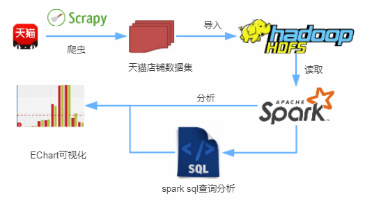
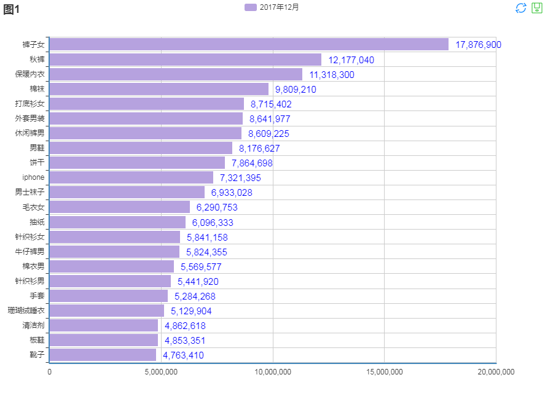

# 1. 说明

本部分是【[spark简单分析天猫年底月销量](http://www.whbing.cn/2018/02/01/1.%E5%A4%A7%E6%95%B0%E6%8D%AE%E5%B7%A5%E5%85%B7%E7%AE%80%E5%8D%95%E5%88%86%E6%9E%90%E5%A4%A9%E7%8C%AB%E5%B9%B4%E5%BA%95%E6%9C%88%E9%94%80%E9%87%8F/)】的第二、三部分即数据分析及展示部分。

### 项目介绍：

利用`scrapy`爬取天猫店铺数据约`50万`条，导入`HDFS`分布式存储，利用大数据组件spark操作算子分析及`sparkSQL`查询分析得出处理结果，最后，`EChart`前端组件将结果以图表形式展现出来。

**流程图**



`EChart`文件夹是单独的图表展示分析，在浏览器中打开即可。


本代码运行环境集群环境、本地local均可。local模式下直接在IDE中运行即可。

**效果展示**

1. 分析结果


2. Echart展示


# 2. 项目流程

## 2.1 新建`maven`项目

```xml

<groupId>cn.whbing.spark</groupId>
<artifactId>Tmall</artifactId>
<version>0.0.1-SNAPSHOT</version>
<packaging>jar</packaging>

```
部分pom代码：（spark-core_2.11，spark-sql_2.11是核心，其他部分暂时不需要）

```xml

<groupId>org.apache.spark</groupId>
    <artifactId>spark-core_2.11</artifactId>
    <version>2.1.2</version>
</dependency>
 
<dependency>
  <groupId>org.apache.spark</groupId>
  <artifactId>spark-sql_2.11</artifactId>
  <version>2.1.2</version>
</dependency>

```

## 2.2 核心代码

`cn.whbing.spark.Tmall.pojo`为javabean包
`cn.whbing.spark.Tmall`为分析包

参考`TopN.java`和`Product.java`代码

在控制台运行`TopN.java`即可(local模式)。


---

附：欢迎补充


